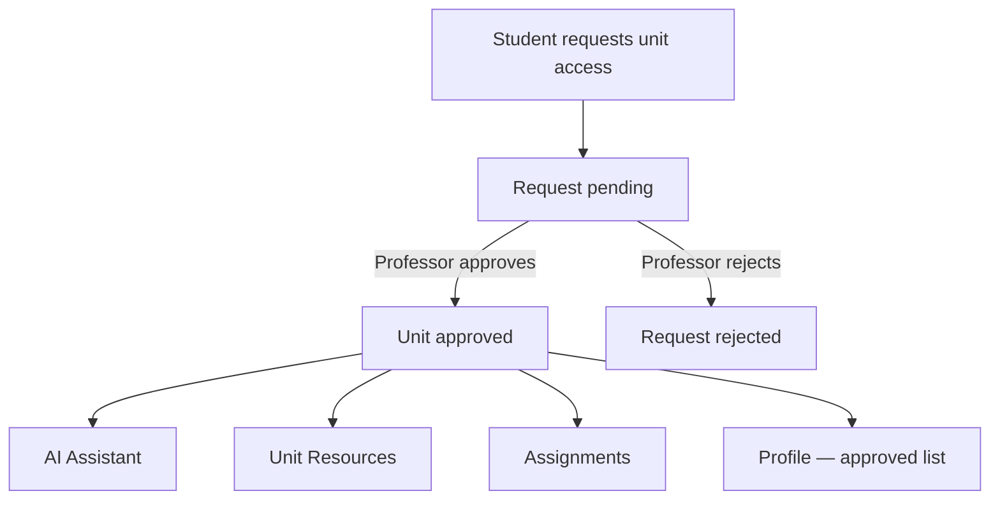

# Student Portal Flow

This document describes how the student-facing UI works and how it connects to the professor admin portal.

## Purpose

Professors use the admin portal to manage course content. Students use this portal to:

- Ask questions via an **AI assistant** scoped to an approved unit
- Browse **unit resources** (materials, guides, templates)
- Track **assignments** and due dates
- View **approved units** and **request access** to additional units

Students only see data for units that a professor has **approved** on the admin side.

---

## Access model

| State | What the student sees |
|-------|------------------------|
| Not approved | Unit does not appear in selectors, resources, or assignments |
| Pending | Shown on profile as pending (future) |
| Approved | Full access to that unit's content |

---

## Pages

### AI Assistant (`/`)

Primary chat experience, similar to ChatGPT.

| Area | Behaviour |
|------|-----------|
| Left panel | Recent chats + **New Chat** button |
| Main panel | Conversation with the Capstone AI assistant |
| Unit selector (top) | Student picks an **approved unit code** (e.g. COS40005). Answers are scoped to that unit's materials and rules |
| Prompt suggestions | Quick-start questions relevant to Capstone |

**Rules:**
- Only approved unit codes appear in the selector
- Chat history is per student (future: persisted via API)

**Future API:**
- `GET /students/me/chats`
- `POST /students/me/chats`
- `POST /students/me/chats/:id/messages` (includes `unitCode`)

---

### Unit Resources (`/unit-resources`)

Lists downloadable/viewable materials for **approved units only**.

| Feature | Behaviour |
|---------|-----------|
| Resource cards | Title, category, description, file type, linked units |
| Search | Filters by title, category, or description |
| Unit filter chips | All My Units, or a specific approved unit |
| Type filter | PDF, ZIP, JPG, etc. |

**Rules:**
- Resources tagged with a unit the student is not approved for are hidden
- View/Download actions will call the backend when files are stored server-side

**Future API:**
- `GET /students/me/resources?unitCode=&search=&fileType=`

---

### Assignments (`/assignments`)

Shows tasks and due dates for **approved units**.

| Feature | Behaviour |
|---------|-----------|
| Assignment list | Title, unit code, due date, required/optional badge |
| Unit filter chips | Same pattern as Unit Resources |
| Status | Upcoming, due soon, overdue (derived from due date) |

**Rules:**
- Only assignments for approved units are visible
- **Required** assignments are flagged — professors mark these on the admin side

**Future API:**
- `GET /students/me/assignments?unitCode=`

---

### Profile (`/profile`)

Account details and unit enrolment.

| Feature | Behaviour |
|---------|-----------|
| Student info | Name, email, student ID |
| Approved units | List of units the professor has approved |
| Request access | Student submits a request for another unit code |
| Sign out | Clears session (future: auth integration) |

**Future API:**
- `GET /students/me`
- `GET /students/me/units`
- `POST /students/me/unit-requests` → `{ unitCode }`

---

### Team Support (`/team-support`)

Placeholder for future team/collaboration features.

---

## Admin portal (professor side)

Handled by Team B in `apps/admin`. Required capabilities:

| Action | Trigger |
|--------|---------|
| Approve/reject unit access requests | Student submits from Profile |
| Upload/manage unit resources | Visible in Unit Resources |
| Create assignments with due dates | Visible in Assignments |
| Mark assignments as required | Shown as required badge to students |

See `docs/admin-flow.md` (to be written by admin team) for professor workflows.

---

## Shared data concepts

| Entity | Key fields |
|--------|------------|
| Unit | `code` (e.g. COS40005), `name`, approval status |
| Resource | `title`, `category`, `fileType`, `units[]` |
| Assignment | `title`, `unitCode`, `dueDate`, `required`, `description` |
| Chat | `id`, `title`, `unitCode`, `messages[]` |
| Unit access request | `unitCode`, `status`: pending / approved / rejected |

---

## Current implementation status

| Feature | UI | API |
|---------|----|-----|
| AI Assistant layout | ✅ Integrated via `StudentProvider` | ⏳ Stub in `@capstone/api-client` |
| Unit selector (approved only) | ✅ Shared `activeUnit` state | ⏳ |
| Chat history + new chat | ✅ Shared chat state | ⏳ Stub |
| Unit Resources + search | ✅ Filtered by approved units | ⏳ Stub |
| Assignments + due dates | ✅ Filtered by approved units | ⏳ Stub |
| Profile + approved units | ✅ Shared student state | ⏳ Stub |
| Request unit access | ✅ Creates pending request (local) | ⏳ Stub |
| Auth / login | ⏳ Placeholder pages | ⏳ |

Shared student state lives in `apps/student/lib/student-context.tsx`.  
Mock catalogue/seed data lives in `apps/student/lib/user-data.ts` until the backend is ready.
